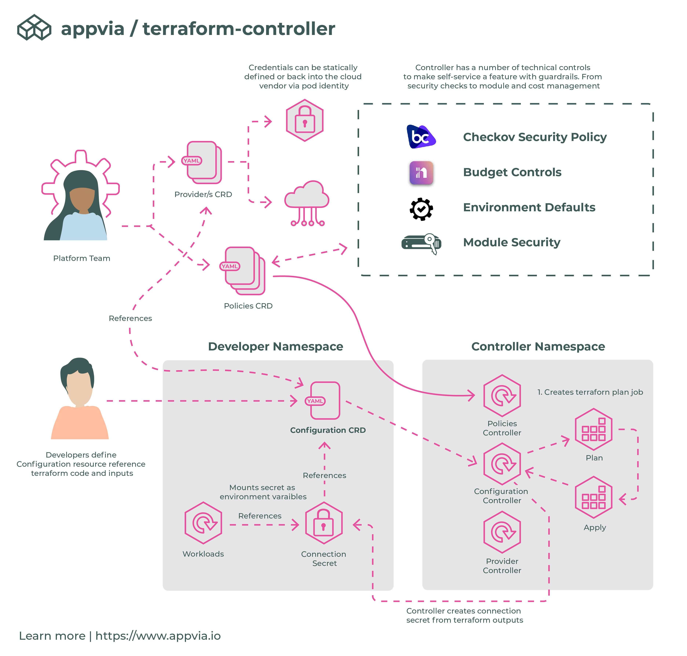

   

# **TERRAFORM CONTROLLER**

Terraform Controller manages the life cycles of a terraform resource, allowing developers to self-serve dependencies in a controlled manner.

Documentation can be found at https://terranetes.appvia.io

**FEATURES**
---

### DEVELOPERS

- [Keep Terraform Configuration simple to use](https://terranetes.appvia.io/terraform-controller/developer/configuration/)
- [Filter and write specific Terraform outputs to a secret](https://terranetes.appvia.io/terraform-controller/developer/configuration/#connection-secret-reference)
- [View full Terraform log output](https://terranetes.appvia.io/terraform-controller/developer/configuration/#viewing-the-changes)
- [Approve changes before application, supporting plan and apply workflows](https://terranetes.appvia.io/terraform-controller/developer/configuration/#approving-a-plan)
- [See cost estimates prior to creating resources](https://terranetes.appvia.io/terraform-controller/admin/costs/)
- [Support private terraform module sources](https://terranetes.appvia.io/terraform-controller/developer/private/)
- [Directly reference FluxCD sources](https://terranetes.appvia.io/terraform-controller/developer/flux/)
- [Drift Detection](https://terranetes.appvia.io/terraform-controller/admin/drift/)

### PLATFORM ENGINEERS

- [Keep cloud credentials secure](https://terranetes.appvia.io/terraform-controller/admin/providers/)
  - Restrict credentials provider use via namespace and label selectors
  - Don't expose credentials within a user's namespace
- [Define Guardrails around use](https://terranetes.appvia.io/terraform-controller/admin/policy/)
  - Restrict to known module sources
  - Validate resource requests against Checkov policies
  - Automatically inject default configuration based on labels
- [ROADMAP] *Apply granular budget controls for namespaces*

**GETTING STARTED**
---

View the getting started guide at https://terranetes.appvia.io/terraform-controller/#quick-start-guide
