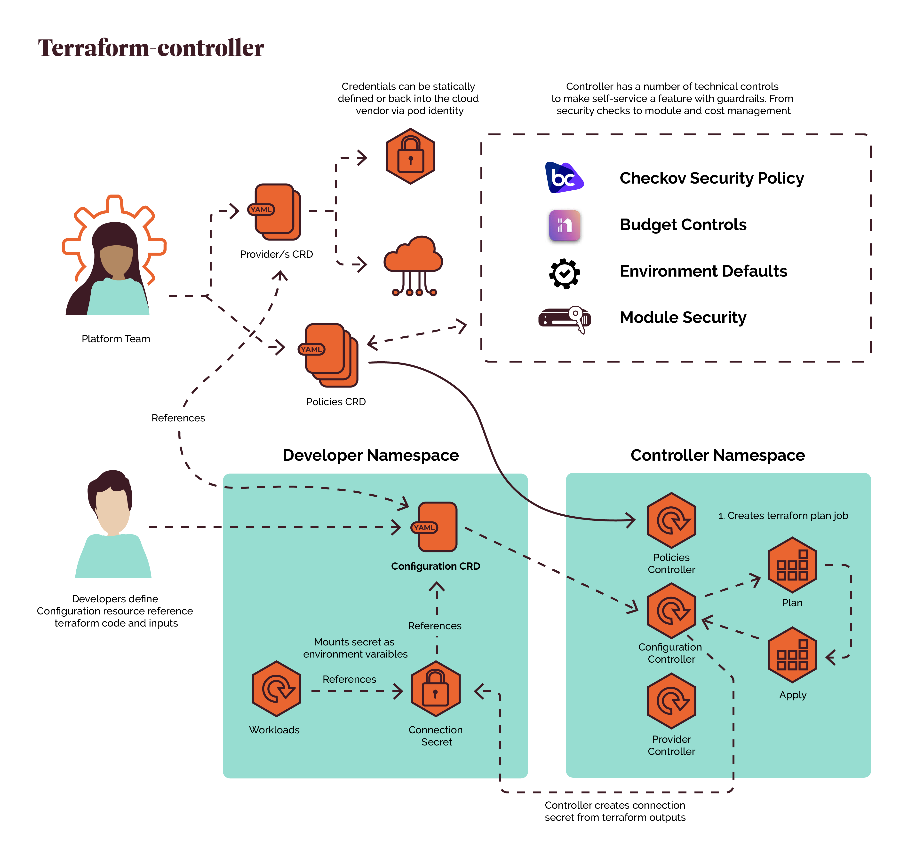

<!-- markdownlint-disable -->

      

<!-- markdownlint-restore -->

# **TERRANETES CONTROLLER**

The Terranetes Controller manages the lifecycle of an OpenTofu or Terraform resource, allowing developers to self-serve dependencies in a controlled manner.

There's a number of open source controllers you could use that will run OpenTofu or Terraform in Kubernetes. All of them deliver the developer outcome, however, none address the "consequences" of delivering that outcome in the first place; the risks, costs, security implications, the general lack of checks and balances. What sets the Terranetes controller apart is its opinion; we first enable the platform team to deliver the outcome in a safe environment before it can be self-served by developers. Providing platform engineers with all the knobs, dials and levers to control and mitigate those risks is the key differentiator for Terranetes controller.

Documentation can be found at https://terranetes.appvia.io/

## **FEATURES**

### DEVELOPERS

- [Keep Terraform Configuration simple to use](https://terranetes.appvia.io/terranetes-controller/developer/provision/)
- [Filter and write specific Terraform outputs to a secret](https://terranetes.appvia.io/terranetes-controller/developer/provision/#connection-secret-reference)
- [View full Terraform log output](https://terranetes.appvia.io/terranetes-controller/developer/provision/#viewing-the-changes)
- [Approve changes before application, supporting plan and apply workflows](https://terranetes.appvia.io/terranetes-controller/developer/provision/#approving-a-plan)
- [See cost estimates prior to creating resources](https://terranetes.appvia.io/terranetes-controller/admin/costs/)
- [Support private terraform module sources](https://terranetes.appvia.io/terranetes-controller/developer/private/)
- [Directly reference FluxCD sources](https://terranetes.appvia.io/terranetes-controller/developer/flux/)
- [Drift Detection](https://terranetes.appvia.io/terranetes-controller/admin/drift/)

### PLATFORM ENGINEERS

- [Keep cloud credentials secure](https://terranetes.appvia.io/terranetes-controller/admin/providers/)
  - Restrict credentials provider use via namespace and label selectors
  - Don't expose credentials within a user's namespace
- [Define Guardrails around use](https://terranetes.appvia.io/terranetes-controller/admin/policy/intro/)
  - Restrict to known module sources
  - Validate resource requests against Checkov policies
  - Automatically inject default configuration based on labels
- [Validate your Terraform Resource Plans](https://terranetes.appvia.io/terranetes-controller/admin/cloudresource/#how-to-validate-a-revision)
  - Validate the Revision syntax
  - Check the specification and provide recommendations on configuration
  - Scan against Checkov security policies
- [Version and publish Resource Plans](https://terranetes.appvia.io/terranetes-controller/admin/cloudresource/#what-are-revisions)

## **GETTING STARTED**

View the getting started guide at https://terranetes.appvia.io/terranetes-controller/quick_start/
